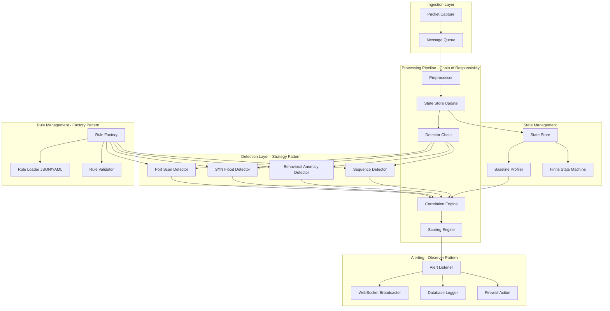

# Architecture du Moteur de Détection d'Anomalies Comportementales

## Diagramme d'Architecture Conceptuel



## Patterns de Conception Appliqués

### 1. Strategy Pattern - Moteurs de Détection
Permet de changer dynamiquement l'algorithme de détection sans modifier le code client.

### 2. Chain of Responsibility - Pipeline d'Analyse
Chaque étape du pipeline peut traiter le paquet et le passer au suivant, permettant une flexibilité maximale.

### 3. Observer Pattern - Système d'Alerting
Les composants s'abonnent aux événements d'alerte et réagissent de manière découplée.

### 4. Factory Pattern - Instanciation des Règles
Création dynamique des règles à partir de fichiers JSON/YAML sans code hardcodé.

### 5. Singleton Pattern - State Store
Instance unique pour la gestion de l'état par IP pour garantir la cohérence.

## Composants Principaux

### State Store
- Stockage en mémoire des états par IP
- Time-series aggregations: débit, ratio succès/échec, entropie des ports
- Finite State Machine pour le séquencement d'états

### Baseline Profiler
- Apprentissage du comportement normal par IP
- Calcul des statistiques de base (moyenne, écart-type)
- Seuils adaptatifs basés sur Z-score

### Correlation Engine
- Agrégation de faibles signaux en incidents
- Scoring pondéré par confiance et contexte
- Détection de patterns multi-étapes

### Scoring Engine
- Calcul du score de risque composite
- Pondération dynamique selon l'historique
- Normalisation des scores sur échelle 0-100

## Structure d'une Règle

```json
{
  "id": "RULE-001",
  "name": "Horizontal SSH Brute Force",
  "version": "1.0.0",
  "severity": "critical",
  "preconditions": {
    "min_confidence": 0.7,
    "min_evidence": 3
  },
  "criteria": [
    {
      "type": "port_scan",
      "threshold": 10,
      "window_seconds": 60
    },
    {
      "type": "auth_failure",
      "service": "ssh",
      "threshold": 5,
      "window_seconds": 300
    }
  ],
  "risk_score": 85,
  "confidence_level": 0.9,
  "evidence_collector": {
    "collect_ports": true,
    "collect_payloads": true,
    "collect_timestamps": true
  },
  "response_action": {
    "type": "block",
    "duration_seconds": 3600,
    "log_level": "critical"
  }
}
```

## Flux de Traitement

1. **Ingestion**: Capture des paquets → Message Queue
2. **Preprocessing**: Normalisation, extraction de métadonnées
3. **State Update**: Mise à jour du State Store pour l'IP source
4. **Detection**: Application des règles via Strategy Pattern
5. **Correlation**: Agrégation des signaux faibles
6. **Scoring**: Calcul du score de risque composite
7. **Alerting**: Notification des observateurs (WebSocket, DB, Firewall)
8. **Response**: Action automatique selon la règle

## Optimisations Performance

- **Structures de données en mémoire**: Dictionnaires avec deque pour sliding windows
- **Concurrent access**: Lock-free structures où possible
- **Lazy evaluation**: Évaluation des critères seulement si nécessaire
- **Caching**: Cache des résultats de détection pour les paquets similaires
- **Batching**: Traitement par lots pour réduire la latence
